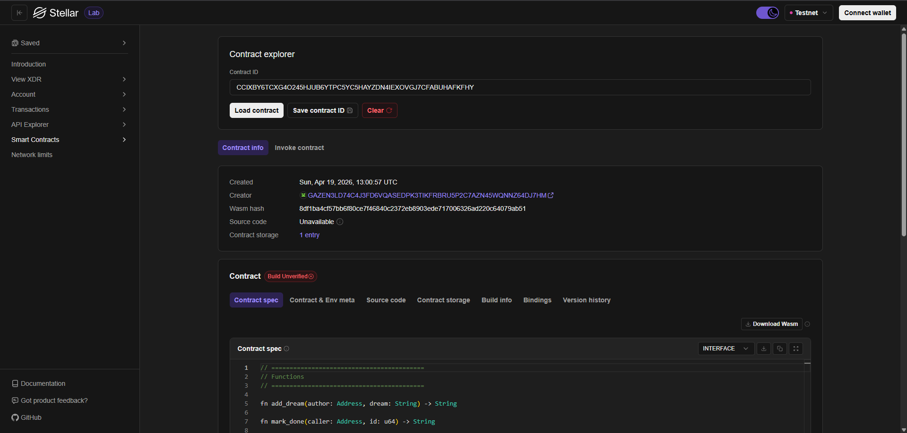
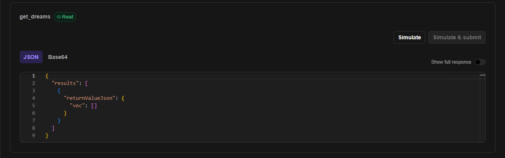
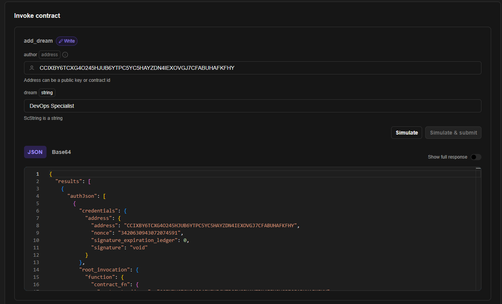

# 🎯 BucketList DApp — On-Chain Bucket List on Stellar

**Author:** Falih Elmanda Ghaisan  
**Network:** Stellar Testnet (Soroban)  
**Built with:** Rust · Soroban SDK · Stellar Blockchain

---

## 📖 Description

BucketList DApp is a decentralized application built on the Stellar blockchain using the Soroban smart contract SDK. It allows users to store their personal bucket list — things they want to do before they die — permanently and immutably on the blockchain.

Every dream you add is stored forever on-chain. When you achieve one, you can mark it as done. No central server, no company that can delete your data — just you and the blockchain.

---

## ✨ Features

| Feature | Description |
|---|---|
| **Add Dream** | Store a bucket list item permanently on-chain |
| **Mark as Done** | Celebrate achievements by marking dreams as completed ✅ |
| **Delete Dream** | Remove a dream from your list (owner only) |
| **View All Dreams** | Retrieve all bucket list items stored in the contract |
| **Author Ownership** | Each item is tied to a wallet address via `require_auth` |
| **Timestamp** | Every dream records when it was added using ledger time |
| **Immutable Storage** | Data lives on Stellar blockchain — permanent and tamper-proof |

---

## 🔧 Smart Contract Functions

```rust
// Add a new dream to your bucket list
add_dream(author: Address, dream: String) -> String

// Get all dreams stored in the contract
get_dreams() -> Vec<BucketItem>

// Mark a dream as completed (owner only)
mark_done(caller: Address, id: u64) -> String

// Delete a dream from the list (owner only)
delete_dream(caller: Address, id: u64) -> String
```

### BucketItem Struct

```rust
pub struct BucketItem {
    id: u64,          // unique identifier
    dream: String,    // the bucket list item
    author: Address,  // wallet address of the creator
    timestamp: u64,   // ledger timestamp when created
    is_done: bool,    // completion status
}
```

---

## 📋 Contract Details

| Property | Value |
|---|---|
| **Contract ID** | `CCIXBY6TCXG4O245HJUB6YTPC5YC5HAYZDN4IEXOVGJ7CFABUHAFKFHY` |
| **Network** | Stellar Testnet |
| **RPC URL** | https://soroban-testnet.stellar.org |
| **Explorer** | https://stellar.expert/explorer/testnet/contract/CCIXBY6TCXG4O245HJUB6YTPC5YC5HAYZDN4IEXOVGJ7CFABUHAFKFHY |

---

## 🖼️ Screenshots

### Contract Deployed on Testnet




### Invoking get_dreams()
<!-- Add screenshot of get_dreams simulation here -->



### Invoking add_dream()
<!-- Add screenshot of add_dream invocation here -->



---

## 🚀 How to Deploy

1. Open [Soroban Studio](https://soroban.studio)
2. Replace `src/lib.rs` with the contract code
3. Click **Build** → **Deploy**
4. Copy the new contract address

---

## 🛠️ Technical Stack

- **Language:** Rust (`no_std`)
- **SDK:** Soroban SDK
- **Network:** Stellar Testnet
- **Storage:** Instance storage (on-chain)
- **Auth:** `require_auth()` for write operations

---

## 💡 Why BucketList on Blockchain?

> *"A goal not written down is just a wish."*

When you write your bucket list on the blockchain, it becomes more than a note — it becomes a permanent, public commitment. The immutability of blockchain ensures your dreams are recorded forever, creating accountability and meaning that a regular notes app simply cannot provide.

---

*Built with ❤️ and AI assistance during Stellar Soroban Workshop*